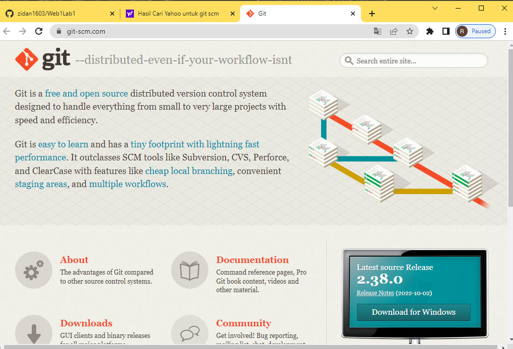
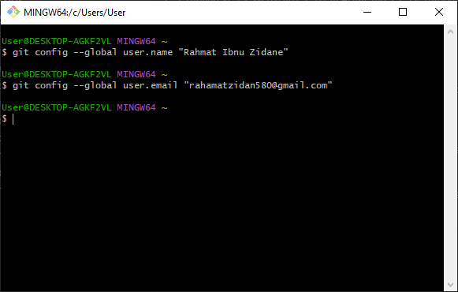
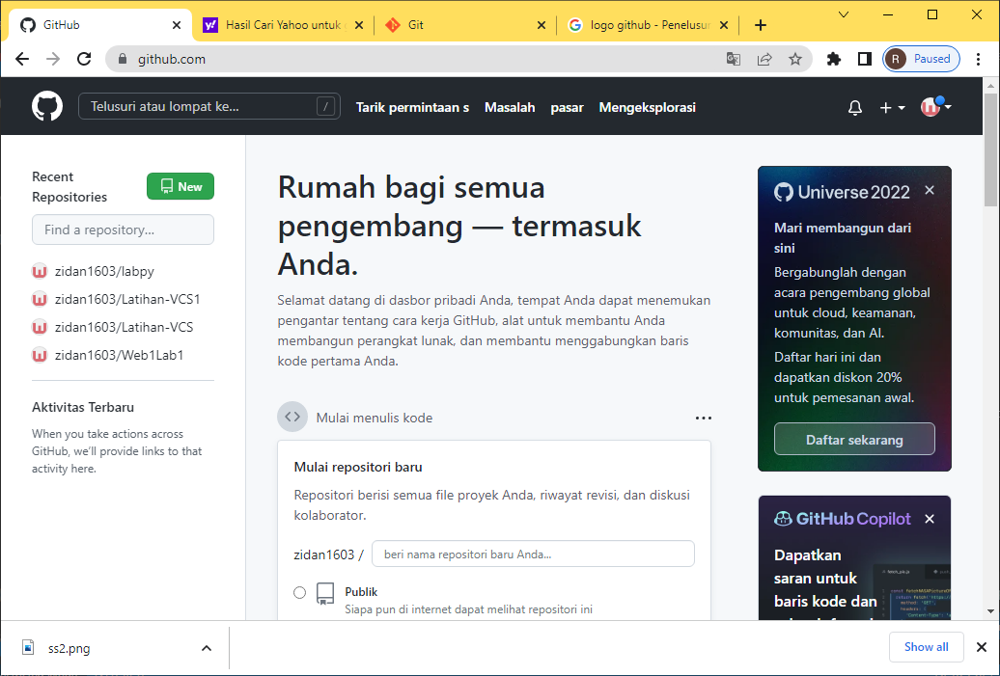

# Web1Lab1
# Git Hub
# Tutorial penggunaan GIT

Pertama kumpulin niat dulu
Setelah niat terkumpul lalu nyalakan laptop atau komputer anda
## Setelah itu download git scm

## Masuk aplikasi git
 Pertama kalian adalah memasukan nama pengguna dengan menggunakan perintah
$ git config -global user.name
"UsernameAnda"
Setelah itu kalian tambahkan juga email kalian dengan menggunakan perintah
$ git config -global user.email 
"Email anda"

## Masuk Github
Kedua klian login github di website kalian lalu akan muncul tampilan dashbord dari github tersebut

