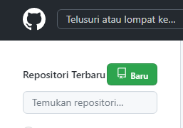
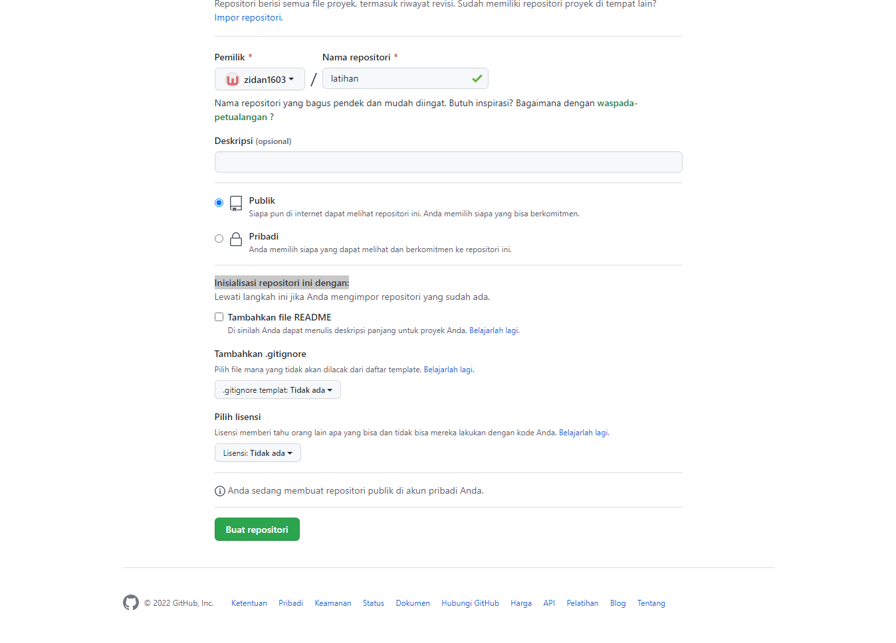
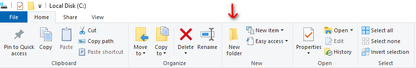
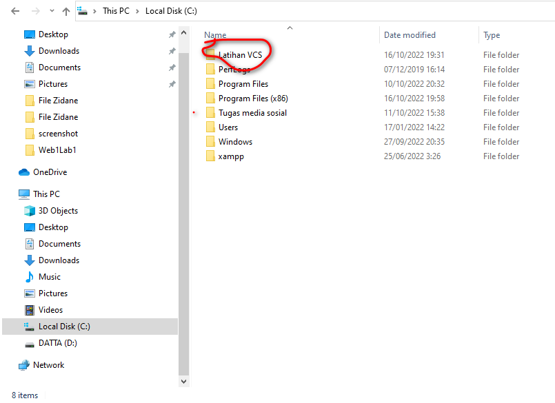

# Web1Lab1
# Git Hub
# Tutorial penggunaan GIT

Pertama kumpulin niat dulu
Setelah niat terkumpul lalu nyalakan laptop atau komputer anda
## Setelah itu download git scm

## Masuk aplikasi git
 Pertama kalian adalah memasukan nama pengguna dengan menggunakan perintah
$ git config -global user.name
"UsernameAnda"
Setelah itu kalian tambahkan juga email kalian dengan menggunakan perintah
$ git config -global user.email 
"Email anda"

## Masuk Github
Kedua kalian login github di website kalian lalu akan muncul tampilan dashbord dari github tersebut

## Buat Repositori
Keiga kalian membuat repositori nya terlebih dahulu,klik tombol baru pada menu repositori untuk membuat repositori terlebih dahulu

Setelah itu kalian akan membuat nama repositori kalian dengan mengklik buat repositori baru

## Membuat File Baru
Keempat kalian membuat file baru di local disk C kalian dengan memberi nama Latihan VCS

